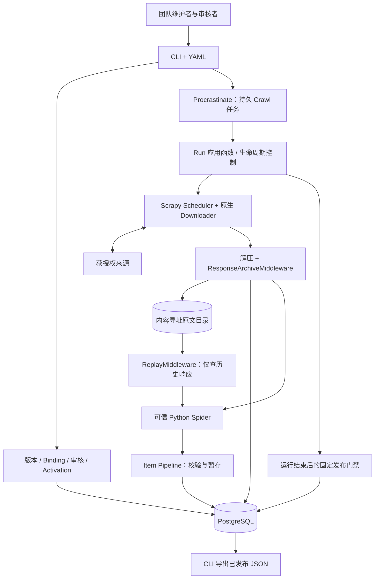
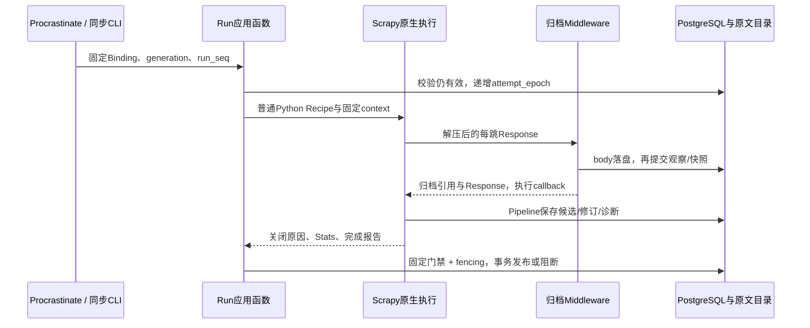

# SEAL V1：可信 Python Recipe 与 Scrapy 原生采集

## 1. 仓库事实、目标与信任前提

状态：修订后的设计基线，尚未实现生产业务。本仓库已有文档和 `experiments/scraper-benchmark/` 独立实验，但没有生产应用、生产依赖锁或数据库迁移。实验中的离线解析与框架试跑不等于本 Plan 的归档、版本、并发和发布合同已经通过。配对实验也未形成有效框架排名。本轮只修订文档，不执行采集 PoC、不安装依赖、不搭基础设施。

V1 目标：团队开发者用普通 Python 接入真实 Source，持续采集并发布可追溯 JSON；来源失效后，发现异常、修复 Recipe、重新验证、手动升级并恢复发布。正常周期不需要逐次人工确认。

**信任前提：Recipe、共享 helper 和依赖由团队开发、审查、维护，属于可信应用代码。** V1 不接入 Agent 自动生成并执行未经人工审查的 Python，不接受外部用户上传任意 Python。可以正常 import、运行普通 Python；网站响应仍是不可信数据，需要大小、类型和业务校验。

**不提供的保证：** Scrapy 的 `allowed_domains`、robots、中间件、参数校验和代码约定都不能阻止恶意 Python 用 socket/其他库绕过访问规则，也不能阻止同权限代码改写数据库或原文。内容哈希用于去重与意外损坏检查，不是签名、防篡改存证或第三方获取证明。普通子进程只管理生命周期，不构成安全隔离。

默认单组织、单主机、CLI 运维；不承诺多租户或分布式高可用。只接入已获采集授权、适合存档的来源；首批支持公开 GET/HEAD、HTML/TXT/JSON 和文本层 PDF。浏览器、OCR、复杂附件合并、需要持久敏感会话的来源暂缓。未来放开代码作者信任时，另写安全 ADR，重新设计代码隔离、网络/凭据边界和供应链验收；不预建 Agent 接口。

## 2. 完整架构与职责划分

### 2.1 最小技术栈与部署

**Scrapy + 可信 Python Recipe + Procrastinate + PostgreSQL + 轻量原文归档。** 决策依据见 [ADR-0002](../adr/0002-python-recipes-minimal-v1.md)，概览见 [Generated](../generated/v1-overview.html)。

- Scrapy 原生 Scheduler、DupeFilter、Downloader、Request/Response、Downloader Middleware、Spider、Item Pipeline、Extensions；不替换 HTTP(S) Download Handler。
- Procrastinate 是唯一持久任务队列，负责周期唤醒、执行锁、有限任务重试及 stalled-job 恢复入口；一个任务对应一次有界 Crawl，而不是一个 URL。
- PostgreSQL 保存 Procrastinate 自有表和 SEAL 业务表，事务与唯一约束负责版本、审核、幂等和当前指针。
- 原文使用本地内容寻址目录即可；确需远端存储再换 S3 兼容接口。不要求 Redis、MinIO、容器或 Kubernetes。
- 解析复用 Scrapy 自带选择器/Parsel/lxml；文本 PDF 使用固定版本 pypdf。边界类型可用 Pydantic，不引入 DSL、统一大 IR 引擎或插件平台。
- 模块化单体：CLI 与 Worker 调用同一组应用函数。每次 Crawl 可启动一个普通短生命周期 Python 子进程，正常导入 Recipe、直接写同一业务存储；解决 reactor 重启和超时收尾，不传输下载 RPC 或不可信 Item 协议。

M1 CLI 同步调用相同的 Run 应用函数；M2 接入 Procrastinate，不做临时任务队列。默认一个生产 Crawl 执行槽，多个 Source 顺序执行，单 Crawl 内按域设置并发/延迟。并发需求出现后再评估扩容；AutoThrottle 不提供跨 Crawl/跨主机总限流。

### 2.2 架构图



以上方框是同仓库模块或 Scrapy 组件，不是独立服务。Recipe 按职责只做发现/提取，不直接修改发布表；这是可信代码的工程约定，不是对恶意代码的权限保证。

### 2.3 从原 Fetcher 分配职责

| 职责 | V1 承担者 | 边界与减法 |
| --- | --- | --- |
| HTTP(S)、连接、超时、响应大小、TLS | Scrapy 原生 Downloader/Handler | 不再自写 HTTP 客户端、代理或 Fetcher RPC |
| 请求调度、分页去重、优先级 | Scheduler/DupeFilter + Spider | 无 PostgreSQL URL Frontier，无每 URL 持久任务 |
| 请求重试 | RetryMiddleware | 有限次数；解析/归档错误不伪装网络错误 |
| 跳转、Cookie、压缩 | Redirect/MetaRefresh、Cookies、HttpCompression | 仅调整归档顺序；Cookie 默认关闭，需要时仅在内存会话启用 |
| 礼貌采集、robots、范围提醒 | 原生延迟/并发/AutoThrottle、RobotsTxt/Offsite；少量 Source 路径检查 | 防误配置，不是网络隔离；默认不使用环境代理 |
| 原文持久化与获取历史 | ResponseArchiveMiddleware + 小型归档函数 | 存应用层 Response；不签发可信收据 |
| 运行统计与异常归并 | Stats、signals、一个 Run 完成扩展 | 不建设监控或状态管理平台 |
| 整个 Crawl 的持久恢复 | Procrastinate + 有界整次重跑 | 不恢复 Python 栈，不以 JOBDIR 保证崩溃恢复 |
| 内容身份、修订、处理版本、审核、发布 | SEAL 应用函数与数据库约束 | 这些是业务能力，框架不能替代 |

访问配置映射到 Scrapy settings，不建立隔离网络平台。请求数/时间预算通过原生限制与小型运行计数检查实现，计入重试和跳转；并发在途请求会造成有限超调，验收报告注明上界。它们是可信程序的成本约束，不是对抗恶意代码的硬限额。V1 不声称 RetryMiddleware 自动实现所有 `Retry-After` 语义：默认不自动重试 429；遇到 429 结束本轮并记录 Source 冷却截止时间，下一次 Procrastinate 唤醒再判断，不再建一套请求重试器。

## 3. 原文归档与 Scrapy Middleware 顺序

### 3.1 归档对象和提交顺序

RawSnapshot 表示 **Scrapy 完成 HTTP 内容解压后、Spider 解析前的应用层响应**。保存 `Response.body` 字节，不保存 `.text` 重编码结果、提取正文或渲染 DOM。HTML 与 PDF 使用同一个二进制存储接口；PDF 文件内的压缩不等于 HTTP Content-Encoding，不额外变换 PDF 字节。

不采集 TLS/TCP 包、传输分块或压缩前网络字节。原始 Content-Length 可能描述压缩体，不能当作归档字节数；分别保存 `body_size` 和必要的来源说明。归档以处理后的头、Response 类型和文本 encoding 重建解析输入，不声称是传输层取证。

最小归档合同：

| 记录 | 必要字段 |
| --- | --- |
| BodyBlob | `sha256(body)`、字节长度、对象位置；相同字节只写一份 |
| RawSnapshot（响应清单） | body 引用、脱敏请求 URL、本跳脱敏 `response.url`、状态、允许响应头、Response 类型、encoding、归档合同版本；元数据清单也有摘要 |
| FetchObservation | `observation_id`、Source、Run ID、attempt epoch、请求关联 ID、请求时间/响应接收时间/归档时间、方法、请求摘要、snapshot 引用、来源类型、结果/错误类别 |
| 跳转关联 | 原入口 URL、每跳 observation、跳转原因和目标；链结束后的最终 URL；未结束链的最终 URL 为 null，不伪填 |
| Run 输入清单 | 实际解析的 snapshot/observation、种子角色、安全请求键、参数/环境摘要；不序列化 Request 对象或 Python callback |

时间区分：`fetched_at` 仅代表真实网络响应接收时间；缓存/Replay 沿用原获取时间，另记 `used_at`。每次真实响应都有独立 Observation，即使 body 相同；没有 Response 的超时/TLS/DNS 错误只写失败诊断，不伪造空原文。

归档先向临时文件写 body，计算摘要并原子安装到内容地址，验证已存在对象的长度/摘要；然后在 PostgreSQL 提交 Snapshot 引用与 Observation。持久化完成后才返回 Response，并注入 `seal_snapshot_id`、`seal_observation_id`。文件与数据库无跨系统 exactly-once：崩溃可能留下孤儿文件，宽限期清理；不允许先提交指向未落盘 body 的有效记录。

归档失败必须使该响应不进入 callback，并标记当前 attempt `archive_failed`，保守地阻断整个 Run 新增发布。不能只 `DropItem`、只打日志或让 Spider 的 errback 吞掉失败后发布剩余结果。完成门禁再次检查输入引用、对象存在与摘要；DB 不可用时不得发布。写盘采用有界异步/线程 I/O 并等待完成，不能用无限后台队列“稍后补存”。

### 3.2 执行顺序的明确配置

官方规则：`process_request` 按优先级从低到高，`process_response` 从高到低；返回新 Request 会中止余下响应链并交回调度。默认 HttpCache=900、Cookies=700、Redirect=600、HttpCompression=590、MetaRefresh=580、Retry=550。因此仅把归档放到 590 以下，会漏掉 Redirect 提前消费的 3xx；放到 600 以上却不调整解压，又可能存压缩体。

归档顺序只需要以下优先级覆盖；这是局部示意，不是完整 settings。超时、robots、预算、429 重试排除等按 Source 规则另行配置，其他中间件优先级沿用锁定版本默认值：

```python
# 设计配置示意，不是已实现的模块；最终顺序须由 M0 输出验证。
DOWNLOADER_MIDDLEWARES = {
    "scrapy.downloadermiddlewares.httpcompression.HttpCompressionMiddleware": 610,
    "seal.archive.ResponseArchiveMiddleware": 605,
}
HTTPCACHE_ENABLED = False
COOKIES_ENABLED = False
```

网络 Response 路径：**Cookies(700，若启用) → HttpCompression(610) → Archive(605) → Redirect(600) → MetaRefresh(580) → Retry(550) → Spider Middleware/HttpError → callback 或 errback**。Stats 等其他默认组件仍存在，M0 输出完整有效顺序。归档之后不得再安装改变 body/encoding 的自定义中间件；若确需变换，保留输入与派生物关系并变更执行 fingerprint。

### 3.3 重试、跳转、压缩、缓存及异常

| 情况 | 归档和业务规则 |
| --- | --- |
| 500/503 后重试成功 | 每个实际响应在 Retry 前存档；各有 Observation，失败页不变成文档修订；最终 200 才可形成候选。复制的 Request 必须重新赋本次请求 ID、覆盖旧归档 ID |
| 301/302/307/308、HTML meta refresh | 每跳先存应用层响应，原生中间件再跟随；保留链与最终 URL。循环/超跳数是 partial，不自写跳转器；跳转前后的 URL 都按 Source 规则检查 |
| gzip/deflate 的 HTML/PDF | 原生组件解压后存 body；去掉已消费 Content-Encoding 的重建语义，保存确定 encoding，不在 Replay 二次解压 |
| 解压失败、未知编码、超限、截断 | 不能声称已有可复现完整 Response；保留错误/可用元数据并阻断发布。`DOWNLOAD_MAXSIZE`、`DOWNLOAD_FAIL_ON_DATALOSS` 及解压大小限制按锁定版本实测 |
| HTTP 404/403/429 或重试耗尽 | 若得到完整 Response 则先存档；之后由 HttpError/errback/门禁分类。404/链接消失不删除历史；403/429 不换代理或绕过限制 |
| DNS/TLS/连接异常 | 没有 body；归档模块的轻量 `process_exception` 在 Retry 之前记诊断，返回 None 交原生重试；完成扩展汇总耗尽后的失败 |
| 归档/其他 `process_response` 异常 | 不假定一定进入全部 `process_exception`；Scrapy 版本/响应异常设置有差异。归档自身显式标记失败再抛出非网络错误，完成扩展兜底，禁止将它列入自动网络重试类别 |
| 200 登录页/验证码/错误页 | HTTP 成功不是业务成功；归档准入允许时留诊断原文，但不接纳为已确认文档修订/结果；需人工判断 |
| HEAD | 保存状态/头与空 body 的方法语义，不把它作为完整正文；文档处理必须有对应 GET 正文 |

**缓存选择：生产与在线 Trial 默认关闭 HttpCache，不实现第二套下载缓存，也不跨 attempt 冻结在线响应。** 每轮实际访问来源，通过 body 去重减少磁盘占用，不用旧缓存冒充新获取。V1 不主动发条件 GET；列表每次完整取得，已知详情独立复查，列表不变不能停止详情复查。

M0 单独打开原生 HttpCache 验证交互，但不据此默认启用生产缓存：

- 缓存由 900 先处理，命中 Response 仍经过全部 `process_response`，随后解压与归档；缓存通常保存的是更早阶段的响应，不能把缓存目录当成应用层原文库。
- 默认 DummyPolicy 不重新验证远端，会缓存错误页；500 的重试可能反复拿同一缓存值。试验用 `dont_cache`/原生忽略状态配置验证差异，生产则明确拒绝开启缓存的配置。
- RFC 策略可把网络 304 转换成旧的 200，还可能在连接异常时回退旧响应。仅看 Archive 收到的 `status` 或 `cached` flag 无法证明本次远端更新检查成功。
- 试验缓存复用只记 `cache_use`、引用原获取，不增加有效网络观察/Revision；找不到来源时标记 `provenance_unknown` 并阻断发布。304 本身没有正文；无快照的 304 绝不作为空文档。
- 默认关闭缓存时遇到意外 304，存观察并阻断本轮，人工检查条件头/源站行为，不暗中做第二套条件请求协议。未来若确需条件缓存，先验证 304/错误回退的明确归因，再修订合同。

### 3.4 敏感信息与历史 Replay

归档响应头使用允许列表，如 Content-Type、Content-Language、公开 ETag/Last-Modified；Location 必须先按 URL 规则处理。禁止保存 Cookie、Set-Cookie、Authorization、Proxy-Authorization、完整请求头、环境变量和密钥。凭据只在内存注入，Cookie jar 不持久化；URL 的 userinfo/敏感 query 不进入原文清单、日志或工件。请求键可含非敏感 `auth_profile_id`，不能把密钥或低熵密钥哈希当标识。

首批优先公开、无敏感会话来源。body 也可能含 Token/个人信息：Source 接入审核需确认可存档内容，并检查已知敏感模式；发现敏感响应时拒绝归档和发布，只保留脱敏原因。不通过改写 body 后仍声称“原文”来解决。不能证明适合存档的来源暂不准入；通用脱敏无法保证识别任意秘密。原文访问/备份受普通操作权限和保留策略约束，依然不防同权限恶意 Python。

Replay 是一个小型 `ReplayMiddleware.process_request`：根据明确的历史输入清单构造标准 Response，命中直接返回，缺失抛出 `replay_miss`，绝不回退 Downloader。优先级放在 robots/auth 等可能发请求的组件之前；Replay 配置关闭 robots 下载、Cookies、HTTP 缓存、重试、跳转、MetaRefresh 和 HTTP 解压。Archive 对 Replay 引用只检查存在性，不新增 FetchObservation。此处不是自定义 Handler，也不提供下载、重试或调度。

详情 Replay 使用已保存的详情/PDF Response 和种子角色进入同一解析 callback。发现 Replay 还需列表、分页、详情的完整输入清单；请求键包含保守 URL、方法、允许请求体摘要、影响响应的非敏感头与请求角色，不能仅按 URL 匹配。跳转后的最终响应映射回原逻辑请求，保留链说明；不重放 Cookie 会话和网络失败时间序列。同一键有多个有效响应时必须显式选定 snapshot，否则 `replay_ambiguous`。新 Recipe 新增请求而清单没有时失败，不能声称完整回放成功。

Replay 复现的是给定应用层输入的解析，不是网络交换。冻结 Response 类型、encoding、相关元数据和环境；禁止 Recipe 依赖隐式当前时间、随机数、在线 helper 或全局可变文件，必要值作为固定 context。离线验收用本地服务器访问计数/出站记录证明受审代码路径没有联网；不把 Replay 配置称为可对抗恶意 Python 的禁网设施。

## 4. Python Recipe、配置与关键接口

### 4.1 Python Recipe 合同

RecipePackage 是普通 Python 文件、共享 helper、参数 Schema 与小 Manifest 的集合。Manifest 只声明 `family` 标签、`entrypoint` 和环境引用；不描述控制流。Recipe 为 `scrapy.Spider` 子类，标准 `start`、callbacks、errbacks 中使用分支、循环、分页和普通函数；`async start()` 所需 Scrapy 版本在 M0 锁定。

| 边界 | 最小合同 |
| --- | --- |
| Run 输入 | 固定 `params` 与 `context`：Source/Binding/RecipeVersion、模式、种子 URL 与角色、Run/attempt、预算、Schema 和环境摘要 |
| 获取 | 标准 `scrapy.Request` / `response.follow`；仅原生下载。Recipe/helper 不另用 requests/socket，作为代码审查约定 |
| 响应 | HTML 使用 Selector；TXT/JSON 使用固定 encoding/解析器；PDF 使用 `Response.body` 与 `pypdf.PdfReader(BytesIO(...))` |
| `document_ref` Item | 来源内稳定 ID 候选或 URL、发现位置、snapshot 引用；应用层按 Source 身份规则确认，不直接接受数据库 Document ID |
| `candidate` Item | 文档身份、主 snapshot、有序补充输入、标题/日期/正文块/附件引用、字段 locator；不包含可自授予的审核或发布状态 |
| `diagnostic` Item | 类别、关联 snapshot/请求、安全限长信息；平台结合 Stats/异常/门禁形成结论，不只信 Spider 自报成功 |

定位只做轻量投影：HTML XPath+摘录，TXT 字符范围，PDF 页码+固定解析器文本跨度，JSON Pointer。pypdf 不保证 OCR、任意阅读顺序和表格坐标。附件只是引用时明确 `not_fetched`；获取附件也走标准 Request 和归档，不默认合并成主文档。字段匹配原文只能发现一类提取错误，不能证明字段含义或网站完整性。

Item Pipeline 核对引用属于本 Source 当前 Run 的观察，或显式批准的 Replay 输入清单；主资源身份/URL 必须匹配，locator 从归档输入重新核对。禁止沿用复制 Request.meta 中的旧观察 ID，也不把 Recipe 自填的 snapshot ID 当作有效血缘。这是防错误引用的业务校验，不是防恶意同权限代码的安全协议。

### 4.2 YAML 与代码分离

以下为拟议配置，不是已实现业务文件。两个 Source 指向同一个不可变 RecipeVersion，参数和审核独立；选择器是普通 Python 函数的参数，不是新 DSL。

```yaml
sources:
  A:
    entry_urls: ["https://a.example/notices/"]
    allowed_hosts: [a.example]
    allowed_path_prefixes: [/notices/]
    methods: [GET, HEAD]
    identity: canonical_url
    output_schema: generic_document.v1
    poll_seconds: 3600
    recheck_seconds: 86400
    budget: {requests: 100, seconds: 120, response_bytes: 10485760}
  B:
    entry_urls: ["https://b.example/bulletins/"]
    allowed_hosts: [b.example]
    allowed_path_prefixes: [/bulletins/]
    methods: [GET, HEAD]
    identity: canonical_url
    output_schema: generic_document.v1
    poll_seconds: 7200
    recheck_seconds: 86400
    budget: {requests: 100, seconds: 120, response_bytes: 10485760}
bindings:
  A:
    recipe_version: sha256:REPLACE_WITH_SAME_VERSION_DIGEST
    params: {links: ".documents a", next_page: "a.next", title: "h1", body: "article"}
  B:
    recipe_version: sha256:REPLACE_WITH_SAME_VERSION_DIGEST
    params: {links: ".bulletins a", next_page: "a[rel=next]", title: ".title", body: ".body"}
```

配置加载拒绝重复键、未知字段和摘要不完整；打包拒绝路径逃逸/越界符号链接。YAML 的修改不会热更新在途 Run。SourceConfig 快照随 Binding 保存；调度、暂停、冷却是 Source 操作字段。访问范围/身份/输出 Schema/影响结果的 settings 变化需新 Binding 和审核；改轮询时间只留控制审计。密钥不进 YAML、代码包或审核材料。

### 4.3 应用接口与依赖方向

| 拟议应用函数 | 责任与返回 |
| --- | --- |
| `register_source(config)` / `pack_recipe(path, environment)` | 校验并保存配置/不可变代码版本；无执行未知构建 hook 的需要 |
| `create_binding(source_id, recipe_version, params)` | 保存确切配置与参数摘要，不改变 Activation |
| `start_run(binding_id, mode, seeds, input_manifest?)` | 创建固定上下文；M1 同步调用，M2 事务入队；返回 Run ID |
| `archive_response(run_context, request, response)` | 写 body、快照、观察；等待成功后返回归档引用；归档模块不调度网络 |
| `stage_item(run_context, item)` | 校验身份/引用/字段，保存 ProcessingResult 或诊断；不自行发布 |
| `finish_run(run_id, attempt_epoch)` | 汇总关闭原因、未决请求/错误、Stats、检查结果，尝试一次固定发布事务 |
| `review` / `activate(expected_generation)` | 审核绑定报告；CAS 追加 Activation 新代次，冲突可见 |
| `withdraw(result_id, reason)` / `export(source_id)` | 独立撤回；只导出当前有效已发布 JSON 和撤回信息 |

这些是内部函数职责，不是 RPC、通用执行协议或 Agent SDK。依赖方向：CLI/任务入口 → 应用函数 → 领域约束/持久化；Scrapy 归档和 Item Pipeline 调用窄存储接口，Recipe 只依赖 Scrapy/解析 helper 和输入输出字段。Run 扩展汇总完成事实，发布函数不嵌入 Spider callback。

## 5. 版本模型、内容历史与幂等

### 5.1 代码共享与独立启用

```text
RecipePackage（普通 Python + 共享 helper + 参数 Schema）
  → RecipeVersion（代码闭包 + 依赖锁 + 执行环境）
      → Binding A（SourceConfig 快照 + 参数 A）→ Review A → Activation A
      → Binding B（SourceConfig 快照 + 参数 B）→ Review B → Activation B
```

RecipeVersion 不属于单一 Source，包内 helper 不可原位替换。摘要包括全部影响执行的源码/资源、固定第三方及传递依赖、Python/Scrapy/reactor/解析器版本、SEAL 执行/归档合同版本、影响行为的系统库/运行环境清单；不只记录 Git commit 或宽松 requirements。环境可为锁定 venv/部署清单，不要求容器镜像。环境不能复现时报告限制，不能冒充确定性 Replay。

Binding fingerprint 再包含 Source 中影响执行的配置、参数、身份规则、输出 Schema、Scrapy settings 和硬校验版本；调度时间/暂停/冷却等纯操作字段不影响处理键，另留审计。Review 绑定确切 fingerprint、Trial/Replay 报告、输入/结果/Gold Fixtures 摘要及人工检查范围。任一影响执行的部分变化需重新验证。生产进程按版本选择独立的普通环境，不原位升级共享环境污染未升级的 Source；同环境可复用相同锁，不建设环境服务。

### 5.2 最小持久实体

九类业务表即可起步；字段与唯一键由实施迁移落实，不为每个名词建表或服务。

| 表 | 语义与核心约束 |
| --- | --- |
| `source` | 稳定 ID、操作配置、调度游标/冷却/暂停、当前 Binding、Activation generation、Run 序号和当前写入序号 |
| `recipe_version` | 不可变代码/环境 manifest；family 只是标签 |
| `binding` | 不可变 SourceConfig 快照、RecipeVersion、参数、fingerprint |
| `decision` | 固定类型的 review/activate/rollback/withdraw/control/publish 审计；不是通用事件溯源引擎 |
| `run` | 模式、Binding/generation、Source 内 run_seq、attempt_epoch、job ID、期限/总尝试上限、输入/报告/结果清单、业务结论；不作为领取队列 |
| `fetch_observation` | 每次获取事实/失败、请求关联、snapshot manifest 引用、是否具备生产接纳资格；网络观察不按内容哈希去重 |
| `document` | Source 内稳定身份、URL、复查时间、最近接纳观察/Revision、当前发布指针 |
| `revision` | 顺序性的主资源 body 变化、前驱、形成它的观察与 snapshot；不设 `unique(document, body_hash)` |
| `result` | ProcessingResult：输入清单、Binding/处理 fingerprint、候选 JSON 摘要、字段定位与检查结果；不可原位改候选 |

RawSnapshot manifest、BodyBlob、代码包、报告、Run→Result 清单和 Gold Fixtures 可放内容寻址目录，不额外建平台。Review/Activation 是 `decision` 的固定类型；当前 Activation 指针放 Source，事务中同时写决议。并发启用使用 expected generation CAS；review 文件自报审核人不能代替受控 CLI 执行身份。

### 5.3 三种变化不能混淆

1. **重复获取相同字节：**新增 FetchObservation，复用 BodyBlob；同一文档最近接纳正文未变，不新增 Revision。记录的是每次实际观察，不声称捕获轮询间所有变化。
2. **原文 A → B → A：**三个顺序 Revision，共用两份 body；A 再现不因哈希去重而丢失变化。HTML 装饰变化也算字节修订，不等于法律/语义修订。
3. **同原文换 Recipe/参数/环境：**增加 ProcessingResult，不制造来源内容修订。处理键覆盖 namespace、Source/文档身份、有序输入 snapshot manifest、Binding/处理 fingerprint；body 相同但 URL/encoding/相关元数据不同不能误复用结果。
4. **同输入同处理键再次执行：**同输出摘要复用 Result，不同摘要报 `nondeterministic_output`，拒绝最后写入覆盖。新 Revision 回到相同输入时可关联已有 Result，但发布事件必须指明这一次 Revision。
5. **获取异常与解析失败：**登录页、截断、404 只存异常观察；已确认身份/正文有效的主资源即使提取失败仍可记录 Revision，Result 不发布。尚不能确认是目标正文时不猜测修订。

默认文档身份为 Source 内保守规范化 URL，或人工配置的站点稳定 ID；不跨 Source 合并文档。正文去重不合并来源、观察、审核或访问权限。若同一 attempt 对同一文档获得不同有效正文，记录全部观察并标记不稳定输入，不用并发到达顺序静默选一个结果。

Observation 插入以本次网络交换 ID 幂等，数据库重试不重复插入；真正重发 HTTP 是新 Observation。Revision 接纳以 observation ID 幂等；Result 以处理键幂等；发布以 Source/文档/Revision/Result/Activation generation 幂等。禁止从 body 哈希推断“之前已经获取过，所以不用记历史”。

## 6. 任务执行、并发与故障恢复

### 6.1 调度与时序

Run 模式为 `trial`、`production`、`recheck`、`replay`，共用同一应用路径。周期发现从列表开始；独立详情复查从已知 Document URL 开始，不能只依赖列表变化。Procrastinate 周期任务查询到期 Source/Document，按 Source/任务类型/时间槽唯一键创建有限 Run；停机错过槽合并成一次补扫，不无限追补。

创建 Run、推进调度游标和 Procrastinate defer 使用同一个受支持的 psycopg 外部连接事务；不再建立 outbox 领取器或业务租约。一个生产执行槽通过 Procrastinate 执行锁/部署并发配置落实；queueing lock 只抑制重复排队，不等同执行锁。`run` 只记录业务事实，队列状态以 Procrastinate 为准。



整个 Crawl 结束并确认 Pipeline/归档写入已完成才发布。`finished`、退出码 0 或 job success 均不等于业务成功。解析异常、归档失败、模板变化、分页失败、异常空集、预算截断记 partial 并阻断本 Run 新增发布；保留旧发布数据及退化/陈旧标记。暂时性基础设施失败可在上限内重试；确定性模板/质量问题置 Source 的 needs_repair 控制标记，直到 Trial/人工复核恢复资格，不能仅靠下一次退出码正常自动清除。明确预先批准的业务分片可独立成为完整 Run，不能把任意半次失败包装成成功分片。

### 6.2 最小 fencing

以下 fencing 用于 production/recheck；Trial/Replay 只更新各自 namespace 的历史/报告，不要求已有生产 Activation，也不领取或推进生产写入序号。

生产任务入队时固定 Binding 和 Activation generation，并分配 Source 内单调 `run_seq`。开始有效 attempt 时，在事务中核对当前 generation/暂停状态，拒绝已经落后于 Source 当前写入序号的 Run；同 Run 重跑递增 `attempt_epoch`。新 Run 开始后推进 Source 当前写入序号，旧 Run 再重试不能抢回资格。

每次更新生产 Document/Revision 当前状态或发布指针，都检查：**Run 的 generation = 当前 Activation，run_seq = Source 当前写入序号，attempt_epoch = Run 当前 attempt，未暂停且未超截止时间。** 发布还检查目标 Revision/观察仍是该文档最新被接纳的版本。检查和更新处于同一事务并按 Source→Run→Document 一致顺序锁定，不能先检查再无条件写入。

过期进程的晚到响应可以保留历史 Observation/诊断，但不得推进当前修订/发布或赋予旧候选新资格。Activation 改变、暂停、回滚均递增 generation；回滚到相同旧 Binding 也创建新代次，不能复活旧任务。新代次需发起新 Run；在途旧 Run 不混用新参数。暂停会阻断后续业务提交并请求取消 Crawl，但不能保证已发请求撤回或恶意代码立即停网。

### 6.3 恢复规则

| 故障或并发情况 | 处理与可见结果 |
| --- | --- |
| Spider 异常退出 | 进程结束不算成功；收集关闭原因/错误，终止本 attempt；解析/配置错误转 needs_repair，不盲目重抓 |
| Worker 被 kill / 无 heartbeat | 显式配置 Procrastinate 官方 stalled 检测与 retry 任务；共享 Run 总尝试/截止限制，不能照抄无界重试循环 |
| 整个 Crawl 重跑 | 从固定种子重新执行普通 Python/Scrapy，内存 frontier 重建；再次网络获取是新观察，body/Result 按合同复用；不冻结前一 attempt 的响应 |
| 新旧任务/旧进程并发 | 执行锁减少正常重叠，fencing 处理 stalled 误判或延迟完成；旧进程即便活着也不能通过应用事务覆盖新数据 |
| 归档成功，解析失败 | 原文与观察保留；修复后 Replay/Trial 生成新 Result；不要求重新取得已经有的解析输入 |
| 归档成功，DB 引用提交失败 | Response 不交 Spider；可能遗留对象，后续去重/清理；不会留下“正常已发布但无原文”的结果 |
| Result 暂存成功，发布失败 | 若 attempt 已完整结束且输入/代次仍有效，重试同一 `finish_run` 事务，无需重新下载；否则留历史，下一 Run 重新核对 |
| 发布事务成功、job 完成回报前崩溃 | 同一 Run 的完成决议/发布幂等键使恢复直接返回已有结论，不重复发布 |
| 超时/OOM/失去父进程 | 普通进程组终止与清理是可靠性措施；父进程监测、deadline 与关闭连接需实测，非沙箱或强制恶意资源隔离 |

网络 RetryMiddleware、整个任务 Procrastinate 重跑和发布事务重入各自只有一个负责层。建议起始上限：可重试网络错误最多重试 2 次，逻辑 Run 最多 3 个 attempts，并有总截止时间；具体值随来源审核固定。stalled 恢复与手工 `retry` 不能重置同一 Run 上限，确需再做创建有审计的新 Run。最大网络代价按“每 attempt 有限请求（含请求重试/跳转）×最大 attempts”评估。

不使用 JOBDIR 作为任意崩溃恢复保证，不序列化 Python 栈/callback，不持久化 URL Frontier。单次有界爬取过大时，优先按真实栏目/时间窗口分片；分片本身是业务输入，不引入 Workflow Engine。

## 7. 固定门禁、人工审核与 JSON 发布

Trial/Replay 使用独立的业务 namespace 与输出前缀，不更新生产文档、修订、调度游标或发布指针；允许引用批准的已有 body。这里是防误操作的数据分区，不是租户安全隔离。少量 Gold Fixtures 保存人工确认原文和独立预期；不增设 Evaluation/EvalRun/GoldCase 平台。

固定发布门禁检查：Binding 已经审核且 Activation 有效，Source 不处于暂停/needs_repair；Run 正常完整结束；归档输入可读/摘要匹配；身份、Schema、必填字段、非空正文、日期、引用/locator 和基础完整性通过；没有未解决的关键发现/下载/解析异常；fencing 和当前 Revision 匹配。检查逻辑固定在应用代码，报告附在 Run，不是可配置规则引擎。Trial/Replay 运行相同的数据硬校验以产生待审材料，但不要求候选已经激活，也不调用生产发布门禁。

| 动作 | 人工要求与发布行为 |
| --- | --- |
| 首次接入 | 有限在线 Trial、少量 Gold Fixtures、人工从来源入口核对分页/文档、明确批准范围，再手动 Activation |
| Recipe/参数/依赖升级 | 历史 Replay + 在线 Trial + 相关 Source 的样本核对，各自审核后手动升级 |
| 异常修复 | 先保存失败事实/原文，改 Recipe 或确认来源恢复，再 Trial/人工确认；不能仅点 retry 清除 needs_repair |
| 正常周期采集 | 在有效 Activation/已审核范围内，通过固定门禁即可自动发布；无需每次人工点通过 |
| 回滚 | 手动选择仍合格旧 Binding，创建新 generation；保留旧版本/运行/审核。配置已不适用则暂停，不强行回滚 |
| 错误发布 | 独立 `withdraw` 决议撤回并暴露原因；回滚不会撤回已发布错误，也不会删除历史 |

独立校验并不完全证明完整性。没有独立预期文档集合时，`coverage.status=unknown`、分母 null，不给 100%。`unknown` 不必阻断已人工批准有限范围内的正常采集，但 JSON/报告必须保留未知及范围；已知集合缺项、模板故障或明显产量骤降则阻断并要求核对。少量 Fixtures 和仅核对成功输出都不能代表全站正确。

发布事务追加 decision 并更新当前指针；JSON 导出读取数据库已发布视图，不直接把 Scrapy Feed 当发布出口。至少包含 Source/Document、Revision、Result、RecipeVersion/Binding、Activation generation、原文摘要/原始获取时间/最近有效观察时间、字段/附件范围、coverage 和来源新鲜度。重复观察可更新新鲜度，不强制重发同一 Result 的发布事件；旧发布指向旧 Revision 时明确标为 stale。

withdraw 在事务中记录结果不再有发布资格，并清除匹配的当前指针；自动任务不得通过 Result 复用将被撤回结果重新发布。需要修复/复核后生成合格结果，不默默回退另一条旧发布。发布文件写临时文件后原子替换；导出失败可重做，不另建消息队列。下游需消费撤回清单/发布事件 ID，已交付错误不会因重导出自动从对方系统消失。

## 8. 最小 CLI、运维与进一步精简

拟议 CLI：`seal source apply`、`seal recipe pack`、`seal binding create`、`seal trial`、`seal replay`、`seal review export/import`、`seal activate --expect-generation N`、`seal run`、`seal worker`、`seal inspect/export`、`seal pause/retry/rollback/withdraw`。当前均未实现。写动作返回结构化回执、冲突/失败非零退出，不提供跳过审核的 `--force`。

维护者使用受控 OS/数据库账号，遵循最小部署权限；Recipe 运行权限与应用信任一致，不声称独立无凭据边界。结构化日志只记录关联 ID、脱敏 URL、错误类别、预算/Stats、最近成功时间和产量；原文受控读取/备份。诊断不可写入 Cookie/Token。合法删除原文时记录影响、阻止继续导出失去证据的结果，不把“不可变”理解为永不删除。

| 删除或推迟 | 原因与替代 |
| --- | --- |
| gVisor、容器沙箱、专用 Python 隔离环境、网络权限平台 | 可信 Recipe 不需要为不可信代码建设执行边界；以后改变作者信任时再设计 |
| 独立 Fetcher、RPC、代理、自定义 Download Handler、签名收据 | 原生下载 + 归档中间件即可；不用网络取证或跨进程协议模拟原方案 |
| 跨 attempt 冻结响应缓存、默认 HTTP 缓存、条件 GET 协议 | 在线重新获取 + body 去重；解析历史用明确 Replay，不混淆缓存与观察 |
| 自研任务领取、URL Frontier、双层 URL 重试 | Procrastinate 管 Crawl，Scrapy 管内部 Request；不加 DBOS/Crawlee/Redis |
| SourceConfigVersion/Activation/Evaluation/Promotion 独立服务 | Binding 快照、decision 与当前指针足够；不建审批工作流 |
| Agent Harness/执行 SDK/自动评测/长期记忆 | 当前无使用者；不预留接口、token 或管理服务 |

Procrastinate 对单次手工 M1 可暂不运行，但周期、持久失败恢复是 M2 必需能力，现阶段删除它会迫使自研队列。Scrapy 与 Procrastinate 粒度不同，不是冗余；同时保留两套 Crawl 工作流引擎才是重复。九类表不必再拆为更多服务；若原文 manifest/报告可存文件，就不预建对象表与通用关联平台。

## 9. M0 至 M3 实施顺序

先确定失败模式与独立预期，再实现行为验收路径和功能。只写真实用户路径 E2E，不在实现后补结构性单元测试。以下命令是**未来必须交付的验收入口，当前脚本不存在**，不是本轮已运行结果。

统一入口为 `scripts/acceptance.sh`；后续阶段复用前阶段，不重复创建测试平台。首次准备隔离测试数据，重跑创建新 namespace，不能污染生产。实施后从仓库根目录分别运行：

```bash
./scripts/acceptance.sh --stage m0 --output artifacts/acceptance/m0
./scripts/acceptance.sh --stage m1 --output artifacts/acceptance/m1
./scripts/acceptance.sh --stage m2 --output artifacts/acceptance/m2
./scripts/acceptance.sh --stage m3 --output artifacts/acceptance/m3
```

| 阶段/命令参数 | 实施内容 | 必须可运行且可观察的退出条件 |
| --- | --- | --- |
| M0 / `--stage m0` | 锁定 Scrapy/reactor/解析环境；原生下载、Archive、最小 Replay；本地合成 HTML/PDF/压缩/跳转/错误站点 | 实际启动 Scrapy，callback 入口前 body 与观察已持久化；HTML/PDF 哈希与独立预期一致；每次 503/跳转均可查，最终解析正确；磁盘/DB 故障时 callback 不得得到该响应且零发布；缓存交互按第 3 节实证；停止源站后 Replay 得到相同 JSON，缺映射失败且零网络访问 |
| M1 / `--stage m1` | 单 Source CLI 注册、包/Binding、Trial/审核/Activation、门禁与 JSON 导出 | 从空测试库操作真实 CLI；未审核/改参数复用旧审核均拒绝；人工核对独立集合后启用，首轮 JSON 字段/原文/版本可追溯；第二轮合格运行无新增人工审核也能发布；错误页/空正文不发布；有限范围无分母时输出 unknown |
| M2 / `--stage m2` | Procrastinate 周期/重跑、详情复查、修订、幂等、Replay、故障恢复与撤回 | Worker 真实运行；列表不变详情更新仍被发现；A→A→B→A 有四次有效观察、三次修订、两份 body；归档/暂存/发布边界 kill 后有限恢复；旧 attempt/旧 Run/旧 generation 被拒；重启不漏永久任务、不重复发布；解析失败后用原文恢复；撤回可从 JSON/历史查到 |
| M3 / `--stage m3` | A/B 共享同 RecipeVersion，分别 Binding/审核；A 失效、修复、独立升级/回滚 | 两个 Source 使用同一初始代码摘要；A DOM 改坏后阻断而 B 持续正确；修复版经 A/B Fixtures、A Replay/在线 Trial/审核，只升级 A；B 仍旧版本且历史/发布不变；A 恢复后回滚创建新代次，撤回错误与回滚独立 |

M0 先以本地确定站点验证机制，M1 在获得 URL/许可后完成一个真实来源的小范围人工核对；M3 至少两个真实接入来源，失效注入使用对应的本地镜像/合成变体，不修改或攻击第三方站点。没有来源许可/独立预期时，如实报告“仅合成路径通过”，不能宣布完整 V1 交付。实验目录已有样本只有经过许可、范围和预期审核后才可复用，不自动获得上线资格。

## 10. 端到端失败方式与验收工件

### 10.1 编码前固定的边界

| 失败方式 | 端到端外部断言 |
| --- | --- |
| Archive 顺序错、500/跳转被吞、压缩重复解码 | 合成服务请求账本与 Observation 对得上；每跳归档在 callback 前；Replay body/文本/PDF 输出与预期一致 |
| 缓存 500、304 重验证、网络错误回退旧缓存 | 实验明确区分 network/cache_use；不伪造新鲜度；生产缓存配置被拒；304 无 body 不产生空修订 |
| 归档失败/敏感头、敏感 query、测试 Token 出现在 body | 前两类敏感字段不入工件；敏感 body 准入拒绝；相关响应不进入解析，Run 零新增发布；测试只使用合成标记 |
| 分页循环、漏一页、部分下载失败、异常零产出 | 有限终止、partial/needs_repair；预期集合缺项阻断；无独立集合时未知，不伪造通过 |
| 损坏/扫描 PDF、编码失败、多标题/含糊日期 | 原文许可范围内可查、明确能力/歧义诊断；不靠重试或猜值生成“正确”JSON |
| Worker 在 body 前后、Result 后、发布提交后被 kill | 无已发布悬空引用；新 attempt 有界重跑；对象/结果复用而观察不丢；发布提交后重入无重复事件 |
| 同一 Run 重跑与新 Run/Activation 并发 | 延迟释放旧进程后当前指针仍是新数据；旧候选最多历史留存，回滚不复活旧 epoch |
| 同一输入换 Recipe、同键不同输出、A→B→A | 分别只新增处理结果、阻断非确定性、保留返回旧内容的顺序历史 |
| Replay 缺失/多义映射、helper 偷偷联网 | replay_miss/ambiguous；本地访问账本证明测试路径零请求；代码审查发现非 Scrapy 网络 helper 即拒绝准入，不声称有强制禁网 |
| 共享 helper/依赖被原位替换、审核后改 YAML | 摘要校验/新 fingerprint 使旧审核失效；未升级 Source 不受环境切换影响 |
| 错误发布后仅回滚 Recipe | 错误仍可查询，直到独立 withdraw；撤回记录及下游导出状态明确，无删除历史 |

### 10.2 命令、环境与证据

前提：锁定 Python/Scrapy/Procrastinate/psycopg/解析器、独立 PostgreSQL 测试库或 schema、临时原文目录、仅本机监听的确定 HTTP 测试站点、固定 HTML/PDF/JSON/TXT 输入与独立期望。M0 不要求运行 Procrastinate；M2/M3 必须使用真实 Worker/周期任务。普通子进程即可，不准备沙箱或代理基础设施。真实来源验收单列许可证/访问许可、范围、频率和人工检查记录。

每阶段产出 `manifest.json`、`assertions.json`、报告、CLI 回执、脱敏 Stats/请求账本、合成原文、候选/发布 JSON、Revision/Binding/Activation/撤回历史。Manifest 包含命令、环境锁、代码/配置/输入/预期摘要和未验证项；每条断言有 expected/actual、PASS/FAIL/BLOCKED、证据路径。工件不含真实凭据/个人信息；可重算摘要与业务断言，不要求不同运行 ID/时间戳一致。通过构建、HTTP 200 或一次退出码 0 不替代这些证据。

当前仅可运行文档检查：`seiso check`，另可检查本地链接与 Generated 源稿一致性。它们不能证明 Middleware 顺序、断电持久性、并发 fencing 或真实来源覆盖。可视化源稿嵌在 Generated 的 `#am-source`，重生成不另建说明文档。

## 11. 必须通过真实 PoC 验证的风险

| 风险 | 验证与失败后的动作 |
| --- | --- |
| 中间件顺序/异常语义随 Scrapy 版本变化 | M0 输出有效顺序；验证压缩 3xx、meta refresh、重试、HttpError、异常传播和 callback 前持久化。不能满足就修窄配置/归档实现，不 fork 引擎或恢复 Fetcher |
| 原生缓存掩盖 304/错误回退 | M0 与实际 HttpCache 对照，保持生产关闭；没有可证的新鲜度归因不得启用条件缓存 |
| Twisted/reactor、阻塞 PDF/文件 I/O 与 Worker heartbeat | 连续运行多个 Crawl、超时/取消/父进程死亡；普通子进程和有界 I/O 足够才进入 M2，不把 event loop 错误解释为需安全平台 |
| 文件落盘与 DB 无跨系统事务 | 磁盘满、提交断连、强杀、重新读取摘要；验证孤儿清理及发布前引用检查，不能声称 exactly-once |
| Procrastinate 外部事务/执行锁/stalled 恢复 | 锁定 connector 版本，验证同事务 defer、重复周期、heartbeat 误判、旧 Worker 回来和总重试上限；不通过则暂停 M2，不补第二套领取系统 |
| 信任、秘密与非确定性输入 | 人工审查代码/依赖/来源；验证合成凭据不入档及 Replay 输出稳定。需要不可信代码或持久敏感会话时另立范围，不降低前提偷偷支持 |
| PDF/来源覆盖/重跑成本 | 人工核对文本页序、缺失文档、分页；测量代表来源时间/内存/网络代价。超出边界先缩范围/业务分片，OCR/大型工作流另评估 |

实现顺序以 M0→M1→M2→M3 为准。本次删除的是尚未实施的机制，没有生产数据迁移义务；历史 [ADR-0001](../adr/0001-recipe-driven-fixed-pipeline.md) 和 ADR-0002 的修订说明保留取舍，不再约束 V1。未来 Agent/外部作者准入会改变信任模型，必须单独重新设计，而不是直接复用 V1 执行权限。
